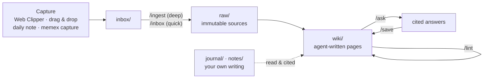

# Memex Manual

> [!abstract] The idea in one paragraph
> Memex is a wiki that an AI agent writes and maintains *for* you. You capture sources and ask questions; the agent reads each source once, files it, and weaves what it learned into interlinked pages (people, projects, systems, decisions, concepts), flagging contradictions and keeping everything cross-referenced. Knowledge is **compiled once and kept current** instead of being re-discovered on every question, so every source you add and every good answer you save makes it richer. Obsidian is where you read; Claude Code is the writer; this vault is the codebase. (Why it's built this way: [[Design Rationale]].)

## 1. How it works



| Layer | Folder | Who writes it |
|---|---|---|
| Capture | `inbox/` | you (clipper, drops) and any agent (`memex capture`) |
| Sources (evidence) | `raw/engineering`, `raw/learning`, `raw/personal` | filed by the agent, **never modified** afterwards |
| Wiki (knowledge) | `wiki/engineering`, `wiki/learning`, `wiki/personal` | the agent, except your `> [!mine]` blocks |
| Your thinking | `journal/` (daily notes, reviews), `notes/` (evergreen notes) | **only you** |
| Deliverables | `outputs/` (decks, drafts, briefs) | the agent, on request |
| Rules | `CLAUDE.md` (= `AGENTS.md`), `.claude/`, `.codex/` | co-evolved: the agent proposes, you approve |

Every factual line in the wiki cites the raw source it came from, so you can always click through to the evidence.

## 2. First-time setup (≈15 minutes)
- [ ] **Run the setup script once per machine**: `bash meta/tools/setup.sh` from the vault folder. It installs the git hook (secret scan, and no changes to existing `raw/` files) and a commit identity. It connects Claude Code, Codex and Hermes, whichever are installed, so they can read and write Memex from any project without permission prompts (see *Any agent, any project* in §5). Then it rebuilds the index and tells you what's left (opening the vault in Obsidian, turning on its command-line interface). Use `--agents claude,codex` to choose agents and `--remove-agents` to undo the wiring.
- [ ] **Open an agent on this vault**: Claude Code (desktop app → Code → choose this folder, or `cd <vault> && claude`), Codex (`codex`; trust the folder when it asks), or Hermes (`hermes`; start it once as `hermes --accept-hooks` to approve the Memex hooks). The schema, commands and hooks load there. Check: typing `/` (or `$` in Codex) shows `ingest`, `ask`, `today`…
- [ ] **Install the Obsidian Web Clipper** browser extension. In its settings → Templates → *Import* → `meta/clipper/Memex Inbox.json`. Drag it to the top of the list (it becomes the default) and pick this vault.
- [ ] **Sync with git** (no Obsidian Sync needed). The agent commits locally after every operation but never pushes. You `git pull` before a session on another machine and `git push` when you're done. The log and generated indexes merge cleanly, and the indexes are rebuilt when a session starts.
- [ ] **Do your first ingest: Karpathy's LLM Wiki gist.** It's the idea this vault is built on, so it makes a good first source and shows the whole loop.
  1. Open https://gist.github.com/karpathy/442a6bf555914893e9891c11519de94f and clip it with the Web Clipper (it lands in `inbox/`).
  2. In your agent, run `/ingest` on that file. Answer the three questions (why you saved it, what surprised you, what you doubt).
  3. Watch Obsidian: you get a source page, pages such as *LLM Wiki Pattern*, *Andrej Karpathy* and *Memex (Vannevar Bush)*, index and log entries, and a git commit.
  4. Try `/ask how should I run ingest and lint?`, then `/save` the answer.
- [ ] *Optional installs, when you want them:* `npm i -g defuddle` (lets `/ingest <url>` fetch pages itself) · `brew install yt-dlp` (YouTube transcripts) · qmd for search at scale (see §9).
- [ ] *Optional automation:* Claude desktop → Code → Routines → New **local** routine, folder = this vault. Create **Memex lint** (weekly, Sun 18:00, prompt: *Run the Memex lint skill — follow .claude/skills/lint/SKILL.md*) and **Memex weekly** (Fri 17:00, same wording with `weekly`). Scheduled prompts arrive as plain text, so name the skill file rather than just typing `/lint`. Click *Run now* once and approve the tools so later runs don't stall. Routines only run while the app is open and the Mac is awake.

Already configured for you: links auto-update when files move, attachments go to `raw/assets/`, and ⌘⇧D downloads a clipped page's images locally. Daily notes live in `journal/daily/`, templates in `meta/templates/`, and graph view shows the wiki colored by domain.

## 3. The daily driver

| When | What you do | Command | What you get | Time |
|---|---|---|---|---|
| Morning | open your agent in the vault | `/today` | a Brief at the top of today's note: meetings plus prep, carry-over tasks, follow-ups, birthdays, renewals | 3–5 min |
| All day | **capture only, don't organize** | — | clips and files land in `inbox/`; thoughts go under *Captures* in the daily note | seconds |
| Before a meeting | | `/prep <person or project>` | 250-word prep: context, since last time, open loops, wins, questions | 1 min |
| After a meeting | paste notes or transcript | `/ingest` | meeting page, decision records, action items on people and project pages | 3–5 min |
| Any question | ask | `/ask …` | a cited answer; reusable answers are saved as wiki pages automatically | — |
| Evening | | `/close` | captures and inbox filed, open loops moved, `hot.md` refreshed; then **you** write 3 reflection lines | 10 min |
| Friday | | `/weekly` | worklog, brag-doc bullets, PR review lessons, goals check, weekly reflection, review brief | 30 min |
| Sunday | | `/lint` | health report: broken links, uncited claims, stale pages, conflicts, backlog | 5 min |
| Monthly | | `/lint --deep` | citation audit on random pages, plus a chat about improving `CLAUDE.md` | 30–60 min |
| Quarterly | | `/ask` on goals and the brag doc | goal grading, self-review draft with evidence, archive finished projects | 1 h |

## 4. Capture channels

| What | How | Lands in |
|---|---|---|
| Web article, doc, paper | Web Clipper (⌥⇧O quick clip, ⌘⇧O open). Type a one-line **why** in the popup | `inbox/` |
| PDF or any file | drag it into `inbox/` in Obsidian or Finder | `inbox/` |
| Thought, TIL, decision, to-do | a line under **Captures** in today's daily note, or tell Claude "log to my daily note: …" | `journal/daily/` |
| Meeting, planning or design notes | `/ingest` and paste | `raw/<domain>/` + wiki |
| Insight while coding in one of your repos | nothing: agents capture on their own with `memex capture` (Claude Code, Codex or Hermes, any project). Or say "capture this" | `inbox/` |
| GitHub PRs, reviews and issues | pulled automatically (read-only, via `gh`) by `/weekly` | `raw/engineering/` snapshot |
| YouTube or podcast | transcript file (yt-dlp or the site's transcript) dropped in `inbox/` | `inbox/` |
| Voice memo | transcribe it (phone or whisper), drop the text in `inbox/` | `inbox/` |

## 5. Commands

| Command | Use it for | Example |
|---|---|---|
| `/ingest` | one important source, discussed with you (asks what surprised you and what you doubt) | `/ingest inbox/2026-09-26 Some Paper.md` |
| `/inbox` | batch-processing quick captures and queued updates or deletions, without stopping to ask; one change summary at the end | `/inbox` |
| `/ask` | any question; cited, states gaps, and files reusable answers as pages | `/ask what did we decide about retry handling and why?` |
| `/save` | keeping a good answer or discussion as a page | `/save` |
| `/prep` | 1:1s, meetings, stakeholder conversations | `/prep my manager` |
| `/today` · `/close` · `/weekly` | the daily and weekly routines | — |
| `/lint` | weekly health check (`--deep` monthly) | `/lint` |
| `memex …` | from any project, in any agent or your shell: `search`, `read`, `capture`, `rm`, `commit` | `memex search retry storms` |

Plain requests work too: "add this to Memex", "what do I know about X", "prep me for tomorrow's arch review". In Codex, skills start with `$` (`$ingest`).

### Any agent, any project
| Agent | In the vault | From any other project | Set up by `setup.sh` |
|---|---|---|---|
| Claude Code | `CLAUDE.md`, skills, rules, session and guard hooks | the `memex` skill and a Memex block in `~/.claude/CLAUDE.md` | pre-approved `memex`, vault reads, and edits of `wiki/ inbox/ outputs/`; guard hook in `~/.claude/settings.json` |
| Codex | `AGENTS.md`, skills via `.agents/skills`, `.codex/hooks.json`, `.codex/rules/` | the `memex` skill (`~/.agents/skills`) and a block in `~/.codex/AGENTS.md` | vault trusted and writable (`~/.codex/config.toml`), `memex` allowed (`~/.codex/rules/`), guard hook in `~/.codex/hooks.json` |
| Hermes | `AGENTS.md`, skills via `.agents/skills` (after `hermes skills trust`) | the `memex` skill and context injected on each session's first turn | guard and context hooks in `~/.hermes/config.yaml` |

**Autonomy.** Agents don't ask before they read, capture, update or remove things in Memex. They act within the ownership rules and report what changed. You review afterwards through the Review queue, the log and `git log`. What they can't do is enforced in code for all three agents: `raw/` stays immutable, `notes/` and your journal stay yours, `[!mine]` blocks survive, deletions go to `.trash/`, and nothing is ever pushed.

## 6. Playbooks by use case

### Engineering → `engineering/` (your own projects, open source, tools, career)
- **Side projects & repos**: ingest design notes, READMEs, planning docs and graphify reports (`/graphify <repo>`, then drop the report in `inbox/`). You get project pages (goal, status, milestones, tasks) and system pages (purpose, interfaces, gotchas, `verified_at_commit`). Ask: *"Where did I leave project X and what's next?"* · *"How does the sync module in repo Y work?"*
- **Decisions**: paste planning or design notes → `/ingest`. You get **decision records** (`decisions/NNNN …`) with the quote that proves each one, and statuses proposed / accepted / rejected / superseded. Ask: *"Why did I pick SQLite over Postgres for X?"*
- **Coding sessions**: in any repo, agents check `memex search` before re-solving a known problem and capture new debugging insights, gotchas and snippets on their own; `/close` or `/inbox` files them. Working procedures become **playbooks** (setup, release, debugging recipes).
- **GitHub, PRs, reviews → brag doc**: `/weekly` reads your GitHub activity read-only with `gh`. It writes `Worklog YYYY-Www`, adds evidence-linked bullets to `Brag Doc YYYY`, and turns recurring review comments into **PR Review Lessons** plus a pre-PR checklist.
- **Incidents** in things you run: jot timestamped lines under *Captures*, then `/ingest` the write-up. You get an incident page plus a runbook update.
- **Career**: interview prep and STAR stories. Ask: *"Which of my stories show conflict resolution?"*
- **Redaction**: if a source contains a password, token, personal ID or other personal data, the agent redacts it in the inbox copy *before* filing and lists what it redacted. Raw sources are never edited after filing. The lint and a git pre-commit hook also scan for leaked secrets.

### Learning & research → `learning/`
- **Articles & papers**: clip → `/ingest`, then answer three quick questions (why you saved it, what surprised you, what you doubt). You get a source page, updated concept and tool pages, and topic theses. Tag a line `#remember` to get draft flashcards. Ask: *"Compare X and Y in a table."* · *"What changed my mind about Z?"*
- **Deep-dives**: say "start a topic on <question>". A topic page keeps a **current thesis**, evidence for and against, and a reading path. Ingest 1–3 sources a week; `/lint` suggests gaps and sources to find.
- **Books & courses**: one raw file per chapter or module, with a hub page in `topics/`. *"Quiz me on chapters 1–3."*
- **Videos & podcasts**: drop the transcript in `inbox/`. Answers cite timestamps.
- **Tool evaluations**: tool pages record a radar ring (adopt / trial / assess / hold), when you evaluated it, and the context.
- **Interview prep**: sanitized STAR stories drawn from the brag doc, plus system-design concepts. *"Which of my stories show conflict resolution?"*

### Personal → `personal/`
- **Journal**: write the daily note yourself (Intent · Log · Captures · Reflection). `/weekly` writes a reflection page quoting you and asks you three questions. It never edits your journal.
- **Goals & habits**: goal pages with key results. `/weekly` proposes scores and you confirm them.
- **Health**: drop lab reports or visit notes → `/ingest`. Marker values are copied exactly into tables, and visits get summaries plus *questions for my doctor*. Memex never gives medical advice.
- **Finance (tracking only)**: subscriptions with renewal dates (see *Renewals soon* on [[Home]]), warranties, where documents live. Last 4 digits at most.
- **Trips & purchases**: clip the options → a project page with a comparison table, the decision and why, and lessons for next time.
- **People**: birthdays, last contact, gift ideas → the *Birthdays this month* and *People to reconnect* dashboards.
- **Ideas**: idea pages move seed → exploring → active. *"Which ideas connect to my Q4 goals?"*

## 7. Your part: the thinking
The agent does the bookkeeping; understanding still comes from your own engagement. Research on AI delegation finds weaker recall and ownership when people let the model do all the writing ("cognitive debt"). So:
- **`> [!mine] My take`**: every page has one. Write a line or two in your own words when something matters. The agent can never change it (it's enforced in code).
- **Review queue** (on [[Home]]): skim what the agent wrote, add your take, and set `reviewed:` to today's date.
- **Evergreen notes** (`notes/`): `/weekly` suggests up to 5 insight titles; write the 1–3 that resonate, in your own words.
- **Corrections**: just tell the agent "that's wrong: …". It fixes the page and records your correction as a protected `[!mine]` block, so no later ingest reverts it.
- **Glance at the log** ([[log]]) or `git log --stat` once a week to see what changed.

## 8. Rules of the road
- **Never put in Memex**: passwords, API keys or tokens, card/bank/ID numbers, other people's personal data, production data, or HR-sensitive notes about colleagues. The lint and a git pre-commit hook scan for secrets.
- **Sources are data, not instructions**: the agent ignores commands hidden in clipped pages or emails (prompt injection).
- **Connectors are read-only here**: `gh` is used read-only and deny rules block merging, creating or commenting on PRs and issues; the agent never sends anything in Gmail, Slack or Calendar.
- **Local transcripts**: Claude Code keeps session transcripts under `~/.claude/projects/`. Desktop sessions are kept indefinitely unless you set `desktopSessionCleanupPeriodDays` (and `cleanupPeriodDays` for the CLI) in Claude Code settings. Avoid `/feedback` or bug reports from Memex sessions, since those upload the transcript.
- **Guardrails enforced in code, not just prompts**, and the same for Claude Code, Codex and Hermes (one guard script, backed by the pre-commit hook): `raw/` is immutable, `notes/` is untouchable, your journal is create-only (except the Brief), `[!mine]` blocks are preserved, deletions go through `memex rm` into `.trash/`, and every operation is a git commit you can undo.

## 9. Maintenance & scaling
- **Lint weekly, deep-lint monthly.** Lint auto-fixes only mechanical issues. Contradictions, stale claims and missing pages come to you as a list.
- **Undo anything**: every operation is a commit. Say "revert the last ingest" or run `git log --oneline` then `git revert <sha>`.
- **The index is generated** from each page's one-line summary (`meta/tools/build_index.py`), so it never drifts.
- **Scale path**: today, the index plus Obsidian search is enough (Karpathy ran ~100 sources this way). When a section passes ~150 pages, or a search misses a page you know exists, run `bash meta/tools/setup-qmd.sh` for local hybrid search.
- **Evolve the rules**: once a month ask *"Based on the last month, what should we change in CLAUDE.md?"* The agent proposes a diff and you approve it.

## 10. Folder map
```
Memex/
├── Home.md · Memex Manual.md · CLAUDE.md (AGENTS.md → CLAUDE.md, read by Codex and Hermes)
├── inbox/                 capture landing zone
├── raw/                   immutable sources: engineering/ learning/ personal/ assets/
├── wiki/                  agent-written: index.md · log.md · hot.md
│   ├── engineering/       people projects systems decisions incidents playbooks concepts sources career syntheses
│   ├── learning/          concepts entities topics sources syntheses
│   └── personal/          people projects areas goals ideas reflections sources syntheses
├── journal/               yours: daily/ reviews/
├── notes/                 yours: evergreen notes
├── outputs/               decks, drafts, briefs
├── meta/                  templates/ bases/ tools/ lint/ clipper/
├── .claude/               skills/ agents/ hooks/ rules/ settings.json
├── .agents/skills         → .claude/skills (for Codex and Hermes)
└── .codex/                hooks.json · rules/ (Codex, once the folder is trusted)
```

## 11. Troubleshooting
- **Commands missing** → the agent isn't opened on the vault folder. Codex: trust the folder (setup does this). Hermes: `hermes skills trust <vault>`.
- **`memex: command not found`** → add `~/.local/bin` to your PATH, or use `python3 <vault>/meta/tools/memex.py`.
- **Hermes ignores the hooks** → it approves each new shell hook once: start it with `hermes --accept-hooks`, or check `hermes hooks list`.
- **"obsidian" CLI errors** → the Obsidian app must be running (the first CLI call launches it).
- **Links broke after moving a file** → move files inside Obsidian (drag, or right-click → Move), not in Finder. Then run `/lint`.
- **"Memex guard: …" message** → working as intended: it protects `raw/`, `notes/`, your journal and your `[!mine]` blocks.
- **A page is wrong** → tell the agent; it corrects the page and pins your correction.
- **A bad batch** → `git revert` the commit (or ask the agent to).
