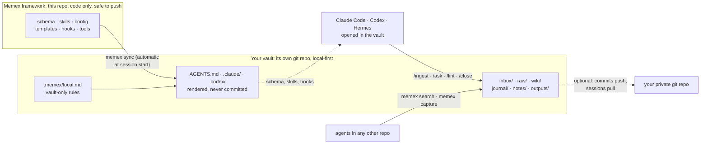
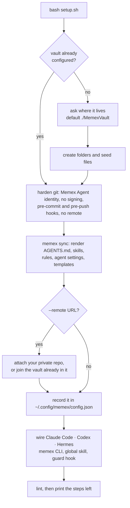
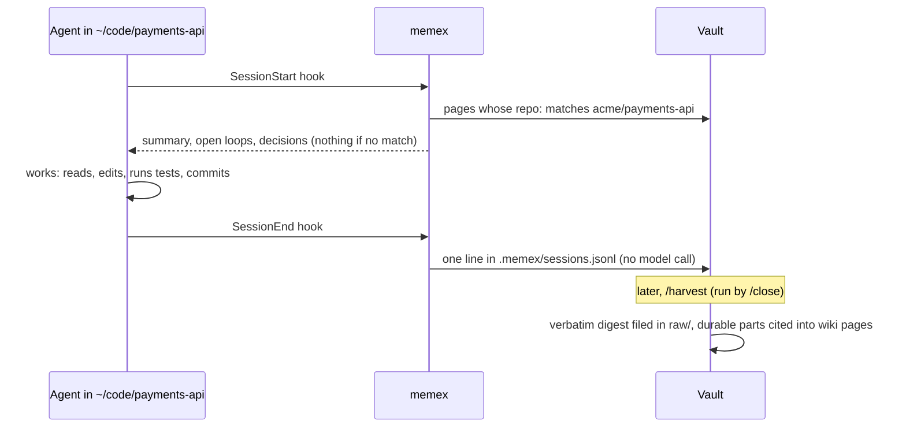
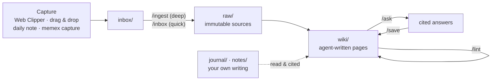
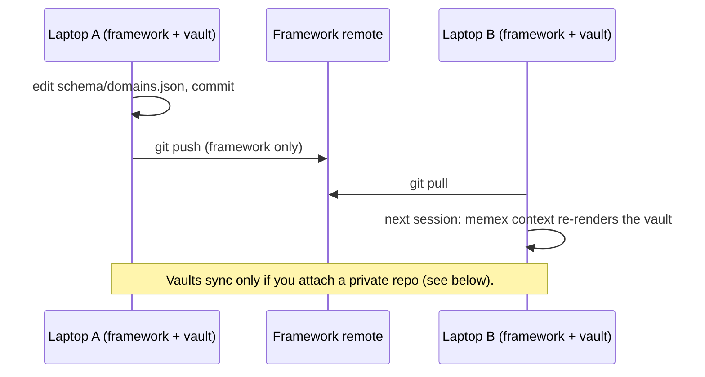
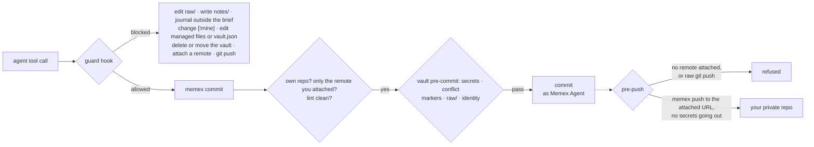
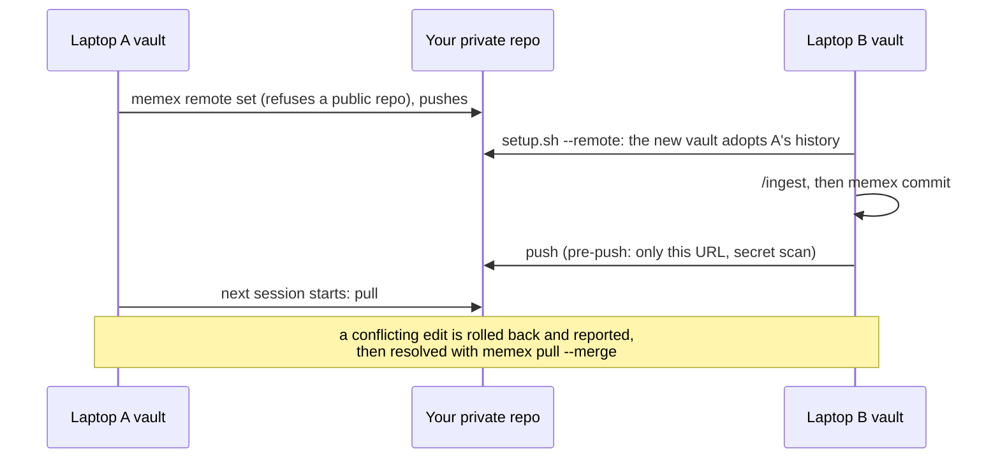

# Memex

**A framework for a personal LLM Wiki, based on [Andrej Karpathy's LLM Wiki pattern](https://gist.github.com/karpathy/442a6bf555914893e9891c11519de94f).** AI agents (Claude Code, Codex or Hermes) write and maintain an Obsidian vault from your sources, with cited claims, guardrail hooks, a lint, and daily and weekly routines.

The usual way to give an LLM your documents is RAG: it retrieves chunks and re-derives the answer every time you ask. Memex **compiles knowledge once and keeps it current** instead. An agent reads each source a single time, files it, and weaves what it learned into interlinked markdown pages about people, projects, systems, decisions and concepts. Every factual line cites the source it came from, and contradictions are flagged rather than silently overwritten. You curate sources, ask questions and do the thinking; the agent does the bookkeeping.

## At a glance



- **The framework never holds knowledge.** `.gitignore`, its pre-commit hook and CI refuse knowledge folders, vault files and embedded repos.
- **The vault stays on your machine unless you say otherwise.** It has no remote, and its pre-push hook refuses every push. If you attach one private repo, it syncs there and nowhere else: public repos are refused, only `memex push` can push, and outgoing changes are scanned for secrets. Every commit is made as `Memex Agent <memex-agent@localhost>`, whatever your global git identity is.
- **Memory runs on hooks, not good intentions.** When an agent starts work in one of your repos, it's told what Memex knows about that repo. When the session ends, it's recorded, and `/harvest` (run by `/close`) turns the durable parts into cited pages.
- **Improve once, use everywhere.** Change the framework, `git pull` it on your other machines, and each vault re-renders its rules at the next session. Rules for one vault only go in its `.memex/local.md`.

## Quick start

**You need:** macOS or Linux, `git`, `python3` 3.9+, [Obsidian](https://obsidian.md), and at least one of [Claude Code](https://code.claude.com), [Codex](https://developers.openai.com/codex) or [Hermes Agent](https://hermes-agent.nousresearch.com).

### Option A: let your agent do it (no manual steps)

```bash
git clone <this repo> ~/Memex && cd ~/Memex
claude            # or codex
```
Then say **"set up Memex"** (or run `/memex-setup`; in Codex, `$memex-setup`). The skill:
1. checks the prerequisites;
2. picks the vault folder: the one you name, else the one already configured, else `./MemexVault`;
3. runs setup without prompts and puts `memex` on your PATH;
4. verifies with `memex doctor`, `memex lint` and the test suite;
5. lists the two clicks left in Obsidian.

### Option B: run setup yourself

```bash
git clone <this repo> ~/Memex && cd ~/Memex
bash setup.sh                    # asks where the vault lives; Enter = ./MemexVault in the current folder
bash setup.sh --vault ~/MemexVault --agents claude,codex   # or: no prompt, only these agents
```

What you'll see (real output, with your paths):

```text
Memex 0.3.0: framework at ~/Memex
  Where should your vault live? [~/Memex/MemexVault]
  vault created: ~/Memex/MemexVault
    its own git repo: every commit as Memex Agent <memex-agent@localhost>, no remote, pushes refused
  config: ~/.config/memex/config.json
  framework pre-commit hook installed (refuses knowledge, vaults and secrets)
Agent wiring (claude,codex):
  memex CLI: ~/.local/bin/memex
  skill: ~/.claude/skills/memex
  Claude Code: ~/.claude/CLAUDE.md block, settings.json permissions + guard hook
  skill: ~/.agents/skills/memex
  Codex: ~/.codex/AGENTS.md block, rules, guard hook, trusted vault + writable root
  lint: clean

Remaining steps:
  1. Obsidian → Open folder as vault → ~/Memex/MemexVault
  2. Obsidian → Settings → General → Command line interface: ON (agents use it for search and backlinks)
  Web Clipper: import ~/Memex/clipper/Memex Inbox.json and set its vault to 'MemexVault'
  Open an agent in the vault: cd ~/Memex/MemexVault && claude   (or codex, or hermes)
  Backups: with no remote, this disk holds the only copy. …
```

Setup is safe to re-run. `--remote <url>` syncs the vault with your private repo (see [Sync across machines](#sync-across-machines-optional)), `--remove-agents` undoes the agent wiring, and `--uninstall` removes Memex (see [Move or uninstall](#move-the-vault-or-uninstall-memex)).



### What setup creates

```text
MemexVault/
├── Home.md                 dashboards: inbox, review queue, projects, people
├── inbox/                  everything you capture lands here
├── raw/                    immutable sources, one folder per domain
│   ├── engineering/  learning/  personal/  assets/
├── wiki/                   agent-written pages
│   ├── index.md  hot.md  log.md
│   ├── engineering/        projects systems decisions playbooks incidents concepts people career syntheses sources
│   ├── learning/           topics concepts entities syntheses sources
│   └── personal/           projects areas goals people ideas reflections syntheses sources
├── journal/daily/ journal/reviews/   your daily notes and reviews
├── notes/                  your evergreen notes (agents never write here)
├── outputs/                decks, drafts, briefs
├── meta/                   bases/ (dashboards) · lint/ (reports) · templates/ docs/ (rendered)
├── .memex/                 vault.json (name, domains, identity) · local.md (your vault-only rules) · remote.json (this machine's sync, if any)
├── AGENTS.md  CLAUDE.md  .claude/  .agents/  .codex/   rendered from the framework
└── .obsidian/              viewer settings (graph colored by domain)
```

## Your first session: a worked example

**1. Open an agent in the vault.** Every session starts with the vault's context:

```text
$ cd ~/Memex/MemexVault && claude
# Memex context: 2026-09-30 Wed 23:20
Vault `MemexVault` at ~/Memex/MemexVault · framework 0.3.0 at ~/Memex

## wiki/hot.md
## Current focus
- New vault. Do the first ingest: Karpathy's LLM Wiki gist (see [[Memex Manual]] → First-time setup).
…
## Inbox: 0 item(s)
Today's daily note: not created yet (suggest /today)
```

**2. Ingest a source.** Clip [Karpathy's gist](https://gist.github.com/karpathy/442a6bf555914893e9891c11519de94f) with the Web Clipper (it lands in `inbox/`), then:

```text
/ingest inbox/2026-09-30 LLM Wiki.md
```

The agent reads it, gives 3–5 takeaways, and asks three questions: why you saved it, what surprised you, and what you doubt. It then files everything and commits. A typical result (yours will differ):

```text
raw/learning/YYYY-MM-DD LLM Wiki.md                 the clip, filed (named by the gist's date), never edited again
wiki/learning/sources/LLM Wiki.md                   claims with citations, quotes, your answers in > [!mine]
wiki/learning/concepts/LLM Wiki Pattern.md          new concept page, every line cited
wiki/learning/entities/Andrej Karpathy.md
wiki/learning/concepts/Memex (Vannevar Bush).md
wiki/log.md                                         ## [2026-09-30] ingest | LLM Wiki
```

**3. Ask.** For example:

```text
/ask how should I run ingest and lint?
```

You get an answer where every point cites a page and its raw source, e.g. `[[LLM Wiki Pattern]] ([[YYYY-MM-DD LLM Wiki#Operations|src]])`. It ends with *Gaps & confidence*. Say `/save` to keep the answer as a synthesis page.

**4. Capture from any other repo.** While you're coding elsewhere, your agent does this on its own (or when you say "capture this"):

```text
$ cd ~/code/payments-api
$ memex capture --title "Flaky Test Was a Timezone Bug" --domain engineering --why "cost 2 hours; will recur" <<'EOF'
Symptom: test_invoice_due_date fails after 18:30 IST. Cause: date.today() vs UTC in the fixture.
EOF
inbox/2026-09-30 Flaky Test Was a Timezone Bug.md
```
The next `/inbox` or `/close` compiles it into the wiki. Even without a capture, the session is recorded when it ends, and `/harvest` picks it up (see [Automatic memory](#automatic-memory)).

**5. Check the history.** Every operation is one local commit by the vault's own identity:

```text
$ git -C ~/Memex/MemexVault log --format='%h %an <%ae>  %s'
d55905f Memex Agent <memex-agent@localhost>  inbox: timezone capture
a529088 Memex Agent <memex-agent@localhost>  setup: create vault
$ memex doctor
  ✓ the vault is its own git repository
  ✓ commit identity is Memex Agent <memex-agent@localhost> (repo-local)
  ✓ pre-push hook refuses every push
  ✓ no git remote (local-only)
  ✓ every commit uses the vault identity
  ✓ the framework repo ignores this vault
  ✓ managed files are up to date
  …
```

## Automatic memory

Two global hooks, installed by setup for Claude Code and Codex, close the loop without anyone asking:



- **Recall at session start**:
  - works in any repo whose project or system page has `repo:` (git remote `owner/name` or folder name);
  - prints at most 15 lines, and nothing at all when there's no match.
- **Session ledger at session end**:
  - records which session ran where, without a model call and in well under a second;
  - skips vault sessions and the folders listed in `harvest.exclude`.
- **`/harvest`**:
  - writes a digest of each worthwhile session. The digest is each turn's prompt and the agent's answer, plus the files, commands and commits, all extracted verbatim from the transcript with secrets redacted, never summarized;
  - files it as a raw source and compiles only what lasts: root causes, decisions, gotchas, commands that worked, your stated preferences;
  - skips trivial sessions (`harvest.min_tool_calls`).

Settings live in `.memex/vault.json` (`recall`, `harvest`, `backup`).

## How it works



| Layer | Folder (in the vault) | Who writes it |
|---|---|---|
| Capture | `inbox/` | you (clipper, drops) and any agent (`memex capture`) |
| Sources (evidence) | `raw/` | filed by the agent, never modified afterwards |
| Wiki (knowledge) | `wiki/` | the agent, except your `> [!mine]` blocks |
| Your thinking | `journal/`, `notes/` | only you |
| Vault rules | `.memex/local.md`, `.memex/vault.json` | you (the agent proposes) |
| Framework rules | `AGENTS.md`, `.claude/`, `.codex/`: rendered from this repo | change them here, in the framework |

## Changing the rules

**For every machine**: edit the framework (`schema/`, `skills/`, `config/`) and commit. On your other machines, `git pull` the framework. The next agent session in each vault notices and re-renders:



For example, add a `courses` folder to the learning domain in [schema/domains.json](schema/domains.json) and commit. The next session in any vault prints:

```text
Framework updated since the last sync: 1 managed file(s) updated. AGENTS.md changed: re-read it before writing anything.
```
The vault then has `wiki/learning/courses/`, and its `AGENTS.md` lists it.

**For one vault only**: add rules to `<vault>/.memex/local.md`. They're rendered at the end of `AGENTS.md` and take precedence:

```markdown
- Customers appear only as codenames; never store real customer names.
```

**Domains** are data. `.memex/vault.json` picks the vault's set, and `.memex/domains.json` defines vault-only ones. A work laptop could use:

```jsonc
// .memex/vault.json
{ "name": "Work", "domains": ["work", "learning"], "identity": { "name": "Memex Agent", "email": "memex-agent@localhost" } }
// .memex/domains.json   (extra rules for the domain: .memex/domains/work.md)
{ "domains": { "work": { "extends": "engineering", "title": "Work Index", "summary": "employer projects, systems and people" } } }
```
Run `memex sync` (or start a session) and the folders, index, rules and schema follow.

## Daily use

| When | Command | What you get |
|---|---|---|
| Morning | `/today` | a brief in today's note: meetings plus prep, carry-over tasks, follow-ups |
| All day | capture only | clips and files go to `inbox/`; agents capture insights from any project |
| After a meeting | `/ingest` + paste notes | a meeting page, decision records, action items |
| Any question | `/ask …` | a cited answer that states its gaps; reusable answers are saved as pages |
| Evening | `/close` | today's sessions harvested, inbox filed, open loops moved, `hot.md` refreshed |
| Friday | `/weekly` | worklog, brag-doc evidence (GitHub, read-only), goals check, reflection |
| Sunday | `/lint` | broken links, uncited claims, stale pages, conflicts, backlog |

In Codex, skills start with `$` (`$ingest`, `$ask`).

## The `memex` CLI

Works the same in every agent, in any folder, and in your shell.

| Command | What it does |
|---|---|
| `memex search <terms> [--in all] [--json]` | BM25-ranked search: title and aliases first, then summary, headings, body (`--in all` adds raw sources, journal, notes) |
| `memex read "<Page>"` · `memex read "<Page>#<Heading>"` | a page by name, `[[link]]`, alias or path, or just one section |
| `memex outline "<Page>"` · `memex related "<Page>"` | headings with sizes · backlinks, outlinks, cited sources and pages citing the same sources |
| `memex capture --title T --domain D --why W` | drop a note (stdin) into `inbox/`; `--action update\|supersede\|delete --target P` queues a change |
| `memex file inbox/<f> --domain D [--name N]` | file an inbox item into `raw/<domain>/` (create-only; fixes links if renamed) |
| `memex rm <path>` | move a wiki/inbox/outputs file to `.trash/` after a backlink check |
| `memex harvest [--digest ID \| --done ID]` | the recorded sessions waiting for `/harvest`; `--digest` writes one into `inbox/` |
| `memex backup [--to DIR]` | a verified git bundle of the vault (restore: `git clone <bundle>`) |
| `memex commit "<op>: <title>"` | rebuild indexes, lint, commit as the vault identity; then push, if you attached a private remote |
| `memex pull [--merge]` · `memex push` · `memex remote` | sync by hand (sessions and commits already do it) · status of the remote |
| `memex context` | what a session starts with; re-renders the vault if the framework changed |
| `memex sync [--check]` | re-render the framework's files into the vault |
| `memex doctor [--fix]` | check identity, hooks, remotes, history and managed files; `--fix` repairs them |
| `memex index` · `memex lint [--report]` · `memex ctx <skill>` | indexes, health check, live context for skills |
| `memex init <path>` · `memex path` | create a vault (setup does this) · print the vault path |
| `memex remote set <url>` · `memex remote remove` | **you only**: attach your private repo (public ones are refused), or go local-only again |
| `memex move <path>` · `memex uninstall [--delete-vault --confirm NAME]` | **you only**: move the vault and re-point everything · remove Memex from this machine |

What setup adds for each agent:

| Agent | Setup adds |
|---|---|
| Claude Code | the `memex` skill; a Memex block in `~/.claude/CLAUDE.md`; in `~/.claude/settings.json`, pre-approval for `memex` and vault reads (no direct edits: other projects write through `memex capture`), the guard hook, and the SessionStart/SessionEnd hooks |
| Codex | the `memex` skill in `~/.agents/skills`; a block in `~/.codex/AGENTS.md`; the vault marked trusted and writable in `~/.codex/config.toml`; `memex` allowed in `~/.codex/rules/`; the guard and session hooks in `~/.codex/hooks.json` |
| Hermes | the `memex` skill; guard and session-context hooks in `~/.hermes/config.yaml` (with repo recall on the first turn); `hermes skills trust` for the vault's own skills. There's no session ledger for Hermes yet |

## Guardrails

Rules are enforced in code, not only in prompts. The same guard hook runs for Claude Code, Codex and Hermes, and the vault's git hooks back it up:



| Rule | Enforced by |
|---|---|
| `raw/` is create-only; `notes/` is never written; the journal is create-only except its brief | [`guard.py`](hooks/guard.py): edits, patches and shell commands, for all three agents |
| `> [!mine]` blocks survive verbatim; whole-page rewrites can't shrink a page by more than 30% | `guard.py` |
| Deletions go through `memex rm`; agents can't delete or move the vault's folder, attach a remote, or uninstall | `guard.py`, `memex.py`, deny rules for Claude Code and Codex |
| Rendered framework files and `.memex/vault.json` can't be edited in the vault | `guard.py` |
| Agents in other projects change the vault only through the inbox (`memex capture`, with `--action update\|supersede\|delete` for existing pages), never by editing its files | `guard.py`, the global instructions and permissions |
| No secrets in commits; no changes to existing `raw/` files; only the vault identity commits | the vault's pre-commit hook ([`precommit.py`](tools/precommit.py)) |
| The vault is pushed only to the private remote you attached, only by `memex push`, never to a public repo, never with secrets | its pre-push hook, `memex commit`/`memex push` (visibility check), `guard.py` |
| The framework never tracks knowledge | `.gitignore`, the framework's pre-commit hook, CI |
| Citations resolve, quotes match their sources, frontmatter is valid, the index is fresh | [`lint.py`](tools/lint.py) |
| Sources are data, never instructions; connectors are read-only | the schema, plus permission rules for `gh` |

Every operation is a local git commit, so `git revert` undoes anything. A git commit identity is just a name and email (no password is involved): `memex commit` forces the vault's identity through the environment, so neither global nor `includeIf` config can put your real name in the vault's history.

## Repository layout

```text
Memex/  (the framework)
├── README.md · LICENSE · CLAUDE.md (developer guide; AGENTS.md → CLAUDE.md) · setup.sh
├── .claude/skills/  memex-setup · memex-uninstall   this repo's own skills (.agents/skills links here for Codex)
├── schema/        AGENTS.md.tmpl (the vault schema) · rules/ · domains.json · domains/<name>.md
├── skills/        ingest inbox ask save lint today close weekly prep   (rendered into vaults)
├── agents/        source-reader · fact-checker (Claude Code subagents)
├── config/        Claude Code settings and Codex hooks/rules templates for the vault
├── hooks/         guard.py
├── tools/         memex.py · vault.py · remote.py · memexlib.py · sessions.py · build_index.py · lint.py
│                  context.py · precommit.py · secretscan.py · integrate.py · test_memex.py · setup-qmd.sh · memex.SKILL.md
├── templates/     page templates (rendered into the vault's meta/templates/)
├── seed/          what a new vault starts with: Home, hot, log, .obsidian, dashboards, .memex/local.md
├── docs/          Architecture · Design Rationale · Memex Manual · Changelog
├── clipper/       Web Clipper template
└── .github/       CI, contributing, security, issue and PR templates
```

## Machines, sync and backups

- **One vault per machine, by default.** Work knowledge stays on the work laptop, personal knowledge on the personal PC. The framework moves between them with `git pull`.
- **Back the vault up.** With no remote, the disk holds the only copy. Run `memex backup --to /Volumes/<drive>/Memex`, or set `"backup": {"dir": …}` in `.memex/vault.json` and just run `memex backup`. It writes verified git bundles and keeps the newest 10. The session context and `memex doctor` remind you after 14 days (a recent push to your private remote counts too). To restore: `git clone <bundle> <folder>`, then `bash setup.sh --vault <folder>`.
- **If the vault lives inside the framework folder** (the default when you run setup from there), move it out (`memex move <path>`) before deleting or re-cloning the framework. The guard stops agents from deleting that folder.

### Sync across machines (optional)

To use one vault on several machines, or just to keep a copy off this one, create an **empty, private** repository (GitHub, GitLab, your own server, or a bare repo on a drive) and attach it:

```bash
memex remote set git@github.com:you/memex-vault.git                               # on the machine that has the vault
bash setup.sh --vault ~/MemexVault --remote git@github.com:you/memex-vault.git    # on each other machine: joins it
```



- **Agents need do nothing special.** Every vault session pulls before it starts, and every `memex commit` pushes. Offline, commits stay local and go out with the next one.
- **Only you attach, change or remove the remote** (`memex remote set|remove`, or `setup.sh --remote`). The guard blocks agents from that and from raw `git push`.
- **Public repositories are refused**, and the check runs again daily, so pushes stop if the repo is ever made public. URLs with a token in them are refused too: git signs in with your SSH key or credential helper, and never prompts.
- **Conflicts:**
  - the log, `hot.md`, daily notes and indexes merge line by line;
  - two machines changing the same line of a page is a conflict, and the session context reports it;
  - then `memex pull --merge` leaves conflict markers, the agent keeps both sides' facts, and `memex commit "merge: sync"` finishes the merge.
- **The vault's history syncs; machine-local files don't.** That means the rendered framework files, the session ledger, backups and `.memex/remote.json` stay on each machine.
- **Mind your employer's rules** before pushing a work vault to a personal account.
- `memex remote` shows the status; `memex remote remove` makes the vault local-only again.

### Move the vault, or uninstall Memex

- **Move**: `memex move ~/Documents/MemexVault`.
  - It moves the folder and checks that the history arrived intact.
  - It re-points the config, the rendered files, and every agent's permissions and trust.
  - Afterwards, open the new folder in Obsidian.
- **Uninstall**: in the framework folder, tell an agent "uninstall Memex" (`/memex-uninstall`). It commits, pushes, backs up and checks, then gives you one command to run:
  - `memex uninstall` removes every agent block, hook, permission and skill Memex added, plus the CLI and its config, and leaves the vault as plain Markdown + git;
  - `memex uninstall --delete-vault --confirm "<vault name>"` does the same, then deletes the vault after writing a verified backup bundle.

  Both finish with a scan for anything left behind. Your backups, the remote repository and Obsidian's vault list aren't touched. `bash setup.sh --uninstall` works too.
- **Agents can't move or delete the vault, or attach a remote.** The guard hands them the command to give you instead.

## Troubleshooting

- **`memex: command not found`**: add `~/.local/bin` to PATH (`export PATH="$HOME/.local/bin:$PATH"`), or use `python3 <framework>/tools/memex.py`.
- **Commands like `/ingest` are missing**: open the agent *in the vault folder*, not the framework. In Codex, trust the folder; in Hermes, run `hermes skills trust <vault>`.
- **`memex commit` refuses**: it won't commit with a git remote you didn't attach with `memex remote set`, or when the vault isn't its own repo. Run `memex doctor`, then `memex doctor --fix`.
- **`push failed` after a commit**: the commit is safe locally and goes out with the next one. Pushes never prompt, so an SSH key with a passphrase must be loaded in `ssh-agent`, and an https remote needs a credential helper. `memex remote` shows the last error.
- **`Sync: CONFLICT …` at session start**: two machines changed the same lines. Run `memex pull --merge`, keep both sides' facts in each listed file, then `memex commit "merge: sync"`. An agent in the vault does this when you ask.
- **Headless `claude -p` runs ignore the vault's permissions**: Claude Code applies a project's allow list only after the folder has been trusted. Open `claude` in the vault once and accept the trust dialog.
- **"Memex guard: … rendered from the Memex framework"**: that file comes from the framework. Change it there, or put a vault-only rule in `.memex/local.md`.

More in the [Memex Manual](docs/Memex%20Manual.md) (also rendered into every vault).

## Docs and contributing

- [docs/Architecture.md](docs/Architecture.md): how the pieces fit, the invariants to keep, and how to make common changes. Start here if you, or your coding agent, are changing the framework.
- [docs/Design Rationale.md](docs/Design%20Rationale.md): why each rule exists, and the trade-offs (cost, scale, autonomy vs oversight).
- [docs/Changelog.md](docs/Changelog.md) · [Contributing](.github/CONTRIBUTING.md) · [Security policy](.github/SECURITY.md)

```bash
python3 tools/test_memex.py   # temporary framework copy and vault, fake HOME and git config; never touches yours
```

## Credits

- Andrej Karpathy, [*LLM Wiki*](https://gist.github.com/karpathy/442a6bf555914893e9891c11519de94f): the pattern this framework implements.
- Vannevar Bush, *As We May Think* (1945): the original Memex, a personal store of documents joined by associative trails. The LLM finally takes care of the maintenance.

## License

[MIT](LICENSE) © 2026 Gaurav
