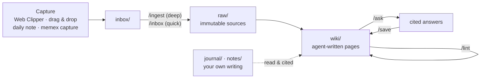

# Memex

**A framework for a personal LLM Wiki, based on [Andrej Karpathy's LLM Wiki pattern](https://gist.github.com/karpathy/442a6bf555914893e9891c11519de94f).** It's an Obsidian vault that AI agents (Claude Code, Codex or Hermes) write and maintain from your sources. It comes with cited claims, guardrail hooks, a lint, and daily and weekly routines.

The usual way to give an LLM your documents is RAG: it retrieves chunks and re-derives the answer every time you ask. Memex **compiles knowledge once and keeps it current** instead. An agent reads each source a single time, files it, and weaves what it learned into interlinked markdown pages about people, projects, systems, decisions and concepts. Every factual line cites the source it came from, and contradictions are flagged rather than silently overwritten. You curate sources, ask questions and do the thinking; the agent does the bookkeeping.

> This repo is the framework: an empty, ready-to-use vault. Clone it, run setup, and start adding sources.

## How it works



| Layer | Folder | Who writes it |
|---|---|---|
| Capture | `inbox/` | you (clipper, drops) and any agent (`memex capture`) |
| Sources (evidence) | `raw/` | filed by the agent, never modified afterwards |
| Wiki (knowledge) | `wiki/` | the agent, except your `> [!mine]` blocks |
| Your thinking | `journal/`, `notes/` | only you |
| Rules | `CLAUDE.md` (= `AGENTS.md`), `.claude/`, `.codex/` | the agent proposes, you approve |

It's organized into three domains, `engineering`, `learning` and `personal`, each with its own folders, generated index and path-scoped rules.

## Features

- **Cited, grounded pages.** Every claim links to a `raw/` source, and load-bearing claims carry verbatim quotes that the lint checks against the source. Old facts are superseded, not deleted. Conflicts become `> [!conflict]` callouts for you to resolve.
- **Works with three agents.** Claude Code, Codex and Hermes all share one schema (`AGENTS.md` links to `CLAUDE.md`), one set of skills and one guard. From any other project, they reach the vault through the `memex` CLI.
- **Autonomous upkeep.** Agents read, capture, update and remove things without asking for permission first, then report what changed. You review afterwards through the Review queue, the log and `git log`.
- **Guardrails enforced in code**, not only in prompts:
  - `raw/` is immutable;
  - `notes/` and your journal belong to you;
  - your `> [!mine]` blocks survive every edit;
  - deletions go to `.trash/`;
  - secrets are blocked at commit time;
  - nothing is ever pushed.
- **Daily-driver routines:** `/today`, `/close`, `/weekly` and `/prep`, plus `/ingest`, `/inbox`, `/ask`, `/save` and `/lint`.
- **A deterministic toolchain** in plain Python 3 (standard library only): index builder, lint, pre-commit scan and the `memex` CLI.
- **Obsidian as the viewer:** dashboards (Bases), a Web Clipper template, callout styles and a graph view.

## Quick start

**Requirements:**
- macOS or Linux
- `git` and `python3` (3.9 or newer)
- [Obsidian](https://obsidian.md), with its command-line interface turned on
- at least one of [Claude Code](https://code.claude.com), [Codex](https://developers.openai.com/codex) or [Hermes Agent](https://hermes-agent.nousresearch.com)

```bash
git clone <your fork or copy of this repo> ~/Memex
cd ~/Memex
bash meta/tools/setup.sh
```

`setup.sh` is safe to re-run. It:
1. installs a git pre-commit hook that scans for secrets and refuses changes to existing `raw/` files;
2. sets a commit identity for agent commits;
3. connects every agent it finds to this vault (details below);
4. rebuilds the index and tells you what's left.

The steps left after that:

1. **Obsidian:** Open folder as vault → this folder. Then Settings → General → **Command line interface: on**.
2. **Web Clipper** (optional): in the browser extension, import `meta/clipper/Memex Inbox.json` and set its vault to this one.
3. **Open an agent on the vault folder:** `claude`, `codex` (trust the folder if asked) or `hermes`. The first time you run Hermes, start it as `hermes --accept-hooks`.
4. **First ingest:** clip Karpathy's gist, then run `/ingest` on it. You'll see a source page, concept pages, index and log entries, and a git commit appear in Obsidian.

The full walkthrough is in [Memex Manual.md](Memex%20Manual.md).

## Daily use

| When | Command | What you get |
|---|---|---|
| Morning | `/today` | a brief in today's note: meetings plus prep, carry-over tasks, follow-ups |
| All day | capture only | clips and files go to `inbox/`; agents capture insights from any project |
| After a meeting | `/ingest` + paste notes | a meeting page, decision records, action items |
| Any question | `/ask …` | a cited answer that states its gaps; reusable answers are saved as pages |
| Evening | `/close` | inbox filed, open loops moved, `hot.md` refreshed |
| Friday | `/weekly` | worklog, brag-doc evidence (GitHub, read-only), goals check, reflection |
| Sunday | `/lint` | broken links, uncited claims, stale pages, conflicts, backlog |

In Codex, skills start with `$` (`$ingest`, `$ask`).

## Using Memex from any project

After setup, agents in *other* repos use the vault through the `memex` CLI and a global `memex` skill:

```bash
memex search retry storms                  # find pages by title, alias and text
memex read "Idempotency Keys"              # print a page (name, [[link]] or path)
memex capture --title "Flaky Test Was a Timezone Bug" --domain engineering --why "will recur" <<'EOF'
Symptom: … Cause: … Fix: …
EOF
memex capture --action update --target "Idempotency Keys" --title "Keys now UUIDv7" <<'EOF'
…
EOF
memex rm "wiki/learning/concepts/Old Page.md"   # checks links first; moves the file to .trash/
memex commit "edit: fix retry note"        # rebuilds indexes, runs lint, commits (never pushes)
```

Captures land in `inbox/`. Queued updates and deletions are applied, with citations, at the next `/inbox` run.

| Agent | What setup adds |
|---|---|
| Claude Code | the `memex` skill; a Memex block in `~/.claude/CLAUDE.md`; in `~/.claude/settings.json`, pre-approval for `memex`, vault reads and edits of `wiki/`, `inbox/` and `outputs/`, plus the guard hook |
| Codex | the `memex` skill in `~/.agents/skills`; a block in `~/.codex/AGENTS.md`; the vault marked trusted and writable in `~/.codex/config.toml`; `memex` allowed in `~/.codex/rules/`; the guard hook in `~/.codex/hooks.json` |
| Hermes | the `memex` skill; guard and session-context hooks in `~/.hermes/config.yaml`; `hermes skills trust` for the vault's own skills |

Choose agents with `bash meta/tools/setup.sh --agents claude,codex`, and undo the wiring with `--remove-agents`. Setup connects one vault per machine.

## Guardrails

| Rule | Enforced by |
|---|---|
| `raw/` is create-only; `notes/` is never written; the journal is create-only except its brief | [`guard.py`](.claude/hooks/guard.py): one pre-tool hook for Claude Code, Codex and Hermes, covering edits, patches and shell commands |
| `> [!mine]` blocks survive verbatim; whole-page rewrites can't shrink a page by more than 30% | `guard.py` |
| Deletions go through `memex rm` (link check, copy in `.trash/`) | `guard.py` and `memex.py` |
| No secrets in commits; no changes to existing `raw/` files | [`precommit.py`](meta/tools/precommit.py) (git pre-commit hook) |
| Citations resolve, quotes match their sources, frontmatter is valid, the index is fresh | [`lint.py`](meta/tools/lint.py) |
| Sources are data, never instructions; connectors are read-only; nothing is pushed | the schema, plus permission rules: Claude Code denies `gh` writes and asks before `git push`; Codex forbids both |

Every operation is a local git commit, so `git revert` undoes anything.

## Repository layout

```
Memex/
├── README.md · LICENSE · Home.md · Memex Manual.md
├── CLAUDE.md              the schema (AGENTS.md → CLAUDE.md)
├── inbox/                 capture landing zone
├── raw/                   immutable sources: engineering/ learning/ personal/ assets/
├── wiki/                  agent-written pages: index.md · log.md · hot.md · <domain>/…
├── journal/ · notes/      your own writing
├── outputs/               decks, drafts, briefs
├── meta/
│   ├── tools/             memex.py · integrate.py · setup.sh · build_index.py · lint.py · precommit.py · test_memex.py
│   ├── templates/         page templates for every type
│   ├── bases/ clipper/    Obsidian dashboards, Web Clipper template
│   └── docs/              Architecture · Design Rationale · Changelog
├── .claude/               skills/ agents/ hooks/ rules/ settings.json
├── .agents/skills         → .claude/skills (for Codex and Hermes)
├── .codex/                hooks.json · rules/
└── .github/               CI, contributing, security, issue and PR templates
```

## Syncing across machines

Use git; you don't need Obsidian Sync. Agents commit locally after every operation but **never push**, so you run `git pull` and `git push` yourself. The log and the generated indexes use `merge=union`, and the indexes are rebuilt when a session starts, so merges stay clean. On a new machine: clone, then run `bash meta/tools/setup.sh`.

## Customizing

- **Rules and domains:** edit `CLAUDE.md` and `.claude/rules/`. The agent can propose changes; ask it *"based on the last month, what should we change in CLAUDE.md?"*
- **Why each rule exists:** [meta/docs/Design Rationale.md](meta/docs/Design%20Rationale.md) covers each rule, what it guards against and its basis, plus the trade-offs (cost, scale, autonomy vs oversight).
- **Scale:** the index alone works up to a few hundred pages. Past that, `bash meta/tools/setup-qmd.sh` adds local hybrid search.

## Contributing and docs

- [meta/docs/Architecture.md](meta/docs/Architecture.md): how the pieces fit, the invariants to keep and how to make common changes. Start here if you, or your coding agent, are changing the framework.
- [meta/docs/Design Rationale.md](meta/docs/Design%20Rationale.md): why each rule exists.
- [Memex Manual.md](Memex%20Manual.md): the full user guide.
- [meta/docs/Changelog.md](meta/docs/Changelog.md) · [Contributing](.github/CONTRIBUTING.md) · [Security policy](.github/SECURITY.md)

```bash
python3 meta/tools/test_memex.py   # tests in a temporary vault with a fake HOME
python3 meta/tools/lint.py          # vault health
```

## Credits

- Andrej Karpathy, [*LLM Wiki*](https://gist.github.com/karpathy/442a6bf555914893e9891c11519de94f): the pattern this framework implements.
- Vannevar Bush, *As We May Think* (1945): the original Memex, a personal store of documents joined by associative trails. The LLM finally takes care of the maintenance.

## License

[MIT](LICENSE) © 2026 Gaurav
