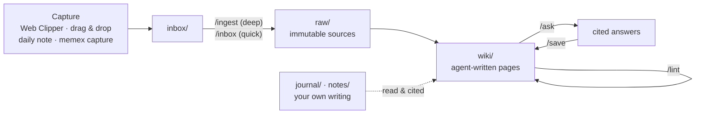

# Memex

**A framework for a personal LLM Wiki, based on [Andrej Karpathy's LLM Wiki pattern](https://gist.github.com/karpathy/442a6bf555914893e9891c11519de94f).** AI agents (Claude Code, Codex or Hermes) write and maintain an Obsidian vault from your sources, with cited claims, guardrail hooks, a lint, and daily and weekly routines.

The usual way to give an LLM your documents is RAG: it retrieves chunks and re-derives the answer every time you ask. Memex **compiles knowledge once and keeps it current** instead. An agent reads each source a single time, files it, and weaves what it learned into interlinked markdown pages about people, projects, systems, decisions and concepts. Every factual line cites the source it came from, and contradictions are flagged rather than silently overwritten. You curate sources, ask questions and do the thinking; the agent does the bookkeeping.

> **This repo is the framework, and it never holds knowledge.** `setup.sh` creates your **vault** in a separate folder with its own git repo that stays on your machine: no remote, pushes refused, every commit by a pseudo identity (`Memex Agent <memex-agent@localhost>`). Improve the framework once, pull it on each machine, and every vault picks the change up.

## How it works



| Layer | Folder (in the vault) | Who writes it |
|---|---|---|
| Capture | `inbox/` | you (clipper, drops) and any agent (`memex capture`) |
| Sources (evidence) | `raw/` | filed by the agent, never modified afterwards |
| Wiki (knowledge) | `wiki/` | the agent, except your `> [!mine]` blocks |
| Your thinking | `journal/`, `notes/` | only you |
| Vault rules | `.memex/local.md`, `.memex/vault.json` | you (the agent proposes) |
| Framework rules | `AGENTS.md`, `.claude/`, `.codex/`: rendered from this repo | change them here, in the framework |

The default domains are `engineering`, `learning` and `personal`. Each has its own folders, generated index and path-scoped rules, and a vault can choose its own set.

## Framework and vault

```
Memex/            ← this repo: schema, skills, hooks, tools, templates. Safe to push; clone it on each machine.
MemexVault/       ← your knowledge (created by setup.sh). Its own local-only git repo; one per machine.
```

- **Change something for every vault** (a new domain, a relaxed rule, a better skill): edit the framework, commit, pull it on your other machines. The next agent session in each vault re-renders `AGENTS.md`, skills, rules and settings from it automatically (or run `memex sync`).
- **Change something for one vault only** (say, confidentiality rules on a work laptop): write it in that vault's `.memex/local.md`. It's rendered at the end of `AGENTS.md` and takes precedence. Vault-only domains go in `.memex/domains.json`.
- **Keep knowledge out of public repos.** The vault is never inside a repo that has a remote. If you create it inside this folder, it's git-ignored here. This repo's pre-commit hook and CI refuse knowledge folders, vault files and embedded repos.

## Features

- **Cited, grounded pages.** Every claim links to a `raw/` source, and load-bearing claims carry verbatim quotes that the lint checks against the source. Old facts are superseded, not deleted. Conflicts become `> [!conflict]` callouts for you to resolve.
- **Works with three agents.** Claude Code, Codex and Hermes all share one schema, one set of skills and one guard. From any other project, they reach the vault through the `memex` CLI.
- **Autonomous upkeep.** Agents read, capture, update and remove things without asking for permission first, then report what changed. You review afterwards through the Review queue, the log and `git log`.
- **Guardrails enforced in code**, not only in prompts:
  - `raw/` is immutable;
  - `notes/` and your journal belong to you;
  - your `> [!mine]` blocks survive every edit;
  - deletions go to `.trash/`;
  - rendered framework files can't be edited in the vault;
  - secrets are blocked at commit time;
  - the vault can't be pushed and only takes commits from its own identity.
- **Daily-driver routines:** `/today`, `/close`, `/weekly` and `/prep`, plus `/ingest`, `/inbox`, `/ask`, `/save` and `/lint`.
- **A deterministic toolchain** in plain Python 3 (standard library only): renderer, index builder, lint, pre-commit checks and the `memex` CLI.
- **Obsidian as the viewer:** dashboards (Bases), a Web Clipper template, callout styles and a graph view.

## Quick start

**Requirements:**
- macOS or Linux
- `git` and `python3` (3.9 or newer)
- [Obsidian](https://obsidian.md), with its command-line interface turned on
- at least one of [Claude Code](https://code.claude.com), [Codex](https://developers.openai.com/codex) or [Hermes Agent](https://hermes-agent.nousresearch.com)

```bash
git clone <this repo> ~/Memex
cd ~/Memex
bash setup.sh
```

Setup asks where the vault should live. The default is `MemexVault` in the folder you run it from; use `--vault PATH` to skip the prompt. It's safe to re-run. It:
1. creates the vault (or reuses the configured one) and renders the framework's schema, skills, rules and agent settings into it;
2. makes the vault its own git repo: a repo-local `Memex Agent` identity that beats any global or `includeIf` identity, no commit signing, a pre-commit hook (secrets, `raw/` immutability, identity) and a pre-push hook that refuses every push;
3. records the vault in `~/.config/memex/config.json` and installs this repo's own pre-commit hook;
4. connects every agent it finds to the vault (details below), lints it and tells you what's left.

The steps left after that:

1. **Obsidian:** Open folder as vault → your vault folder (not this one). Then Settings → General → **Command line interface: on**.
2. **Web Clipper** (optional): in the browser extension, import `clipper/Memex Inbox.json` and set its vault to yours.
3. **Open an agent in the vault folder:** `claude`, `codex` (trust the folder if asked) or `hermes`. The first time you run Hermes, start it as `hermes --accept-hooks`.
4. **First ingest:** clip Karpathy's gist, then run `/ingest` on it.

The full walkthrough is in [docs/Memex Manual.md](docs/Memex%20Manual.md) (it's also rendered into the vault).

## Daily use

| When | Command | What you get |
|---|---|---|
| Morning | `/today` | a brief in today's note: meetings plus prep, carry-over tasks, follow-ups |
| All day | capture only | clips and files go to `inbox/`; agents capture insights from any project |
| After a meeting | `/ingest` + paste notes | a meeting page, decision records, action items |
| Any question | `/ask …` | a cited answer that states its gaps; reusable answers are saved as pages |
| Evening | `/close` | inbox filed, open loops moved, `hot.md` refreshed |
| Friday | `/weekly` | worklog, brag-doc evidence (GitHub, read-only), goals check, reflection |
| Sunday | `/lint` | broken links, uncited claims, stale pages, conflicts, backlog |

In Codex, skills start with `$` (`$ingest`, `$ask`).

## Using Memex from any project

After setup, agents in *other* repos use the vault through the `memex` CLI and a global `memex` skill:

```bash
memex search retry storms                  # find pages by title, alias and text
memex read "Idempotency Keys"              # print a page (name, [[link]] or path)
memex capture --title "Flaky Test Was a Timezone Bug" --domain engineering --why "will recur" <<'EOF'
Symptom: … Cause: … Fix: …
EOF
memex capture --action update --target "Idempotency Keys" --title "Keys now UUIDv7" <<'EOF'
…
EOF
memex rm "wiki/learning/concepts/Old Page.md"   # checks links first; moves the file to .trash/
memex commit "edit: fix retry note"        # rebuilds indexes, runs lint, commits as the vault identity (never pushes)
memex sync                                 # re-render the framework's files into the vault
memex doctor                               # check identity, hooks, remotes and managed files
```

Captures land in `inbox/`. Queued updates and deletions are applied, with citations, at the next `/inbox` run.

| Agent | What setup adds |
|---|---|
| Claude Code | the `memex` skill; a Memex block in `~/.claude/CLAUDE.md`; in `~/.claude/settings.json`, pre-approval for `memex`, vault reads and edits of `wiki/`, `inbox/` and `outputs/`, plus the guard hook |
| Codex | the `memex` skill in `~/.agents/skills`; a block in `~/.codex/AGENTS.md`; the vault marked trusted and writable in `~/.codex/config.toml`; `memex` allowed in `~/.codex/rules/`; the guard hook in `~/.codex/hooks.json` |
| Hermes | the `memex` skill; guard and session-context hooks in `~/.hermes/config.yaml`; `hermes skills trust` for the vault's own skills |

Choose agents with `bash setup.sh --agents claude,codex`, and undo the wiring with `--remove-agents`.

## Guardrails

| Rule | Enforced by |
|---|---|
| `raw/` is create-only; `notes/` is never written; the journal is create-only except its brief | [`guard.py`](hooks/guard.py): one pre-tool hook for Claude Code, Codex and Hermes, covering edits, patches and shell commands |
| `> [!mine]` blocks survive verbatim; whole-page rewrites can't shrink a page by more than 30% | `guard.py` |
| Deletions go through `memex rm` (link check, copy in `.trash/`); the vault's folder can't be deleted or moved | `guard.py` and `memex.py` |
| Rendered framework files and `.memex/vault.json` can't be edited in the vault | `guard.py` |
| No secrets in commits; no changes to existing `raw/` files; only the vault identity commits | the vault's pre-commit hook ([`precommit.py`](tools/precommit.py)) |
| The vault is never pushed and never gets a remote | its pre-push hook, `memex commit`, and deny rules for Claude Code and Codex |
| The framework never tracks knowledge | `.gitignore`, the framework's pre-commit hook, CI |
| Citations resolve, quotes match their sources, frontmatter is valid, the index is fresh | [`lint.py`](tools/lint.py) |
| Sources are data, never instructions; connectors are read-only | the schema, plus permission rules for `gh` |

Every operation is a local git commit, so `git revert` undoes anything.

## Repository layout

```
Memex/  (the framework)
├── README.md · LICENSE · CLAUDE.md (developer guide; AGENTS.md → CLAUDE.md) · setup.sh
├── schema/        AGENTS.md.tmpl (the vault schema) · rules/ · domains.json · domains/<name>.md
├── skills/        ingest inbox ask save lint today close weekly prep
├── agents/        source-reader · fact-checker (Claude Code subagents)
├── config/        Claude Code settings and Codex hooks/rules templates for the vault
├── hooks/         guard.py
├── tools/         memex.py · vault.py · memexlib.py · build_index.py · lint.py · context.py · precommit.py
│                  secretscan.py · integrate.py · test_memex.py · setup-qmd.sh · memex.SKILL.md
├── templates/     page templates (rendered into the vault's meta/templates/)
├── seed/          what a new vault starts with: Home, hot, log, .obsidian, dashboards, .memex/local.md
├── docs/          Architecture · Design Rationale · Memex Manual · Changelog
├── clipper/       Web Clipper template
└── .github/       CI, contributing, security, issue and PR templates
```

## Syncing across machines

Only the framework syncs: `git pull` it on each machine, and each vault re-renders at its next session. Vaults don't sync. They're local-only by design, one per machine (say, work knowledge on the work laptop and personal knowledge at home). With no remote, your disk holds the only copy, so keep Time Machine on or make a periodic `git -C <vault> bundle create <drive>/vault.bundle --all`. If the vault lives inside the framework folder, move it out before deleting or re-cloning the framework.

## Customizing

- **Rules and domains for every vault:** edit `schema/` and `skills/` here. Ask an agent *"based on the last month, what should we change in the schema?"*
- **Rules and domains for one vault:** `.memex/local.md`, and `domains` in `.memex/vault.json` plus `.memex/domains.json` (for example `{"domains": {"work": {"extends": "engineering", "title": "Work Index", "summary": "employer projects"}}}`).
- **Why each rule exists:** [docs/Design Rationale.md](docs/Design%20Rationale.md) covers each rule, what it guards against and its basis, plus the trade-offs (cost, scale, autonomy vs oversight).
- **Scale:** the index alone works up to a few hundred pages. Past that, `bash tools/setup-qmd.sh` adds local hybrid search.

## Contributing and docs

- [docs/Architecture.md](docs/Architecture.md): how the pieces fit, the invariants to keep and how to make common changes. Start here if you, or your coding agent, are changing the framework.
- [docs/Design Rationale.md](docs/Design%20Rationale.md) · [docs/Memex Manual.md](docs/Memex%20Manual.md) · [docs/Changelog.md](docs/Changelog.md) · [Contributing](.github/CONTRIBUTING.md) · [Security policy](.github/SECURITY.md)

```bash
python3 tools/test_memex.py   # tests in a temporary framework copy and vault, with a fake HOME and git config
```

## Credits

- Andrej Karpathy, [*LLM Wiki*](https://gist.github.com/karpathy/442a6bf555914893e9891c11519de94f): the pattern this framework implements.
- Vannevar Bush, *As We May Think* (1945): the original Memex, a personal store of documents joined by associative trails. The LLM finally takes care of the maintenance.

## License

[MIT](LICENSE) © 2026 Gaurav
