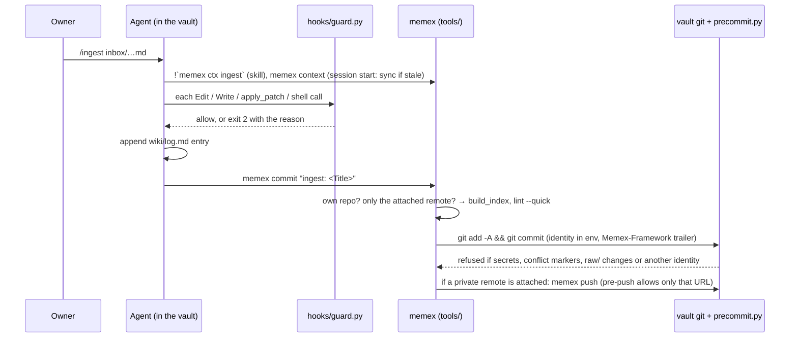
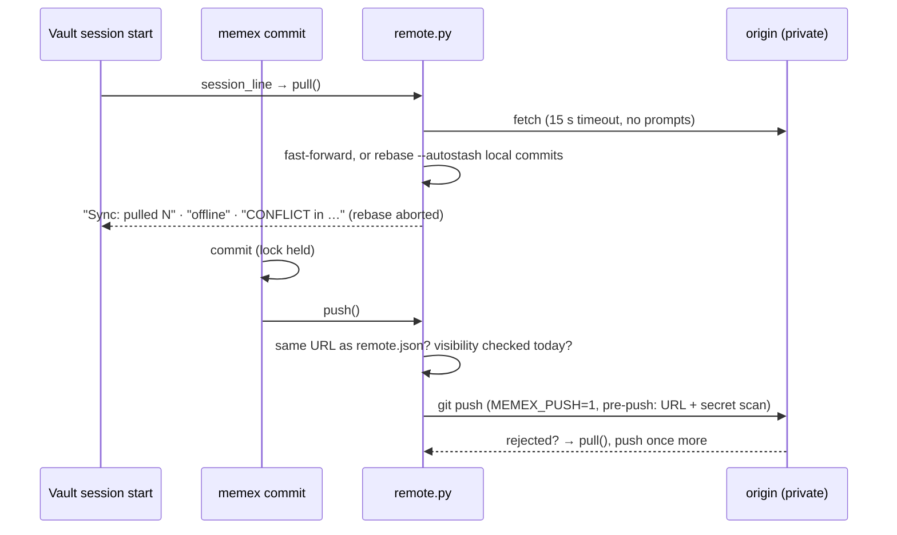

# Architecture

This guide is for anyone changing the **framework**: its tools, hooks, skills and schema. It's written for people and for coding agents. Agents *maintaining a wiki* follow the vault's `AGENTS.md` instead. Why each rule exists is in [[Design Rationale]].

## Two repos: framework and vault

```
Memex/                      FRAMEWORK: code only. Clone it on every machine; push it wherever you like.
  schema/ skills/ agents/ config/ templates/ docs/ seed/ hooks/ tools/ setup.sh
<anywhere>/MemexVault/      VAULT: the owner's knowledge. Its own git repo: every commit as "Memex Agent
                            <memex-agent@localhost>"; no remote unless the owner attaches one private remote.
  inbox/ raw/ wiki/ journal/ notes/ outputs/ Home.md meta/bases/ meta/lint/ .obsidian/   vault-owned (committed)
  .memex/vault.json · .memex/local.md · .memex/domains.json · .memex/domains/*.md          vault config (committed)
  AGENTS.md CLAUDE.md .claude/ .codex/ .agents/ meta/templates/ meta/docs/ Memex Manual.md  managed (rendered, not committed)
  .memex/state.json · remote.json · sessions.jsonl · backup.json · backup/                 machine-local (not committed)
```

- **Why split.** Framework improvements (a new domain, a relaxed rule, a better skill) reach every vault by pulling the framework, and knowledge can never end up in the framework's repo or its remote.
- **One vault per machine.** `~/.config/memex/config.json` records `{"vault", "framework"}`. Every tool resolves the vault from `$MEMEX_VAULT` first, then that file (`memexlib.vault()`).
- **Optional private remote.** The owner may attach one (`memex remote set`, or `setup.sh --remote` to join from another machine). Its URL lives in the machine-local `.memex/remote.json`, so each machine may use its own URL form. See *Sync* below.
- **The vault may sit inside the framework folder** (setup's default when run from there). The framework's `.gitignore` covers `/MemexVault/`, and `memex init` adds any other in-framework path to `.git/info/exclude`. `memexlib` refuses a vault that the framework doesn't ignore. The guard refuses to delete or move a folder that holds the vault, and blocks `git clean -ff/-x/-X` and `git stash --all` there.

## Components

| Piece | File(s) | Role | Invoked by |
|---|---|---|---|
| Schema | `schema/AGENTS.md.tmpl` | ownership table, page conventions, integrity rules, procedures; `{{VAULT_NAME}} {{VAULT}} {{FRAMEWORK}} {{DOMAINS}} {{LOCAL_RULES}}` … | rendered to the vault's `AGENTS.md` by `memex sync` |
| Domains | `schema/domains.json`, `schema/domains/<name>.md`; vault: `.memex/domains.json`, `.memex/domains/<name>.md` | folders, index title, blurb, graph color and path rule per domain; `vault.json` picks the set | `memexlib.domain_specs()` → index, lint, capture, schema, rules |
| Path rules | `schema/rules/*.md` + one per domain | per-folder rules (`paths:` frontmatter is generated) | Claude Code loads `.claude/rules/` by path; other agents are told to read them |
| Skills, subagents | `skills/<name>/SKILL.md`, `agents/*.md` | ingest, inbox, ask, save, lint, today, close, weekly, prep; source-reader, fact-checker | `/name` (Claude Code, Hermes), `$name` (Codex) |
| Agent config | `config/*.tmpl` | vault permissions, SessionStart and guard hooks for Claude Code and Codex | rendered into `.claude/settings.json`, `.codex/` |
| Render & sync | `tools/vault.py` | `outputs()` is the render map; `sync()` writes it, backs up hand edits, updates `.git/info/exclude` and `.memex/state.json` | `memex sync`, `memex context` (session start), setup |
| Git safety | `tools/vault.py` (`harden_git`, `commit`), `tools/precommit.py` | local identity, no signing, local hooksPath, pre-commit and pre-push hooks; commits with the identity in the env | `memex init`, setup, `memex commit`, `git commit` |
| Guard | `hooks/guard.py` | blocks tool calls that break the ownership table, touch managed or owner-only files, or endanger the vault's folder | every agent's pre-tool hook (vault and global config) |
| CLI | `tools/memex.py` | `path context search read outline related capture file rm commit ctx index lint harvest backup pull push remote move uninstall init sync doctor hook` | agents in any project, skills, hooks, the shell |
| Index, lint, context | `tools/build_index.py`, `tools/lint.py`, `tools/context.py` | generated indexes; deterministic checks; live context for skills | `memex index`, `memex lint`, `memex ctx`, `memex commit` |
| Secrets | `tools/secretscan.py` | the patterns shared by lint, capture, pre-commit and session digests (`redact`) | — |
| Session hooks | `memex hook session-start` / `session-end` (`tools/memex.py`), installed globally by `integrate.py` | start: repo-aware recall (pages whose `repo:` matches; silent otherwise); end: one ledger line in `.memex/sessions.jsonl`, no model call | Claude Code and Codex SessionStart/SessionEnd, Hermes `pre_llm_call` (recall only) |
| Harvest | `tools/sessions.py`, `skills/harvest/` | reads Claude Code and Codex JSONL transcripts into verbatim digests (one turn = prompt + the agent's last answer, plus files, commands and commits; secrets redacted), then the skill files and compiles them | `/harvest`, `/close`, `memex harvest` |
| Retrieval | `tools/memex.py` (`rank`, `section`, `cmd_related`) | BM25 over weighted fields; section reads (`Page#Heading`), outlines and related pages for progressive disclosure | `memex search/read/outline/related`, skills |
| Backup | `tools/vault.py` (`bundle`, `backup_age`) | verified git bundles of the vault, pruned to `backup.keep`; age reported by doctor and the session context | `memex backup` |
| Sync | `tools/remote.py`; the pre-push check in `tools/precommit.py` | attach/detach (owner only; refuses public repos and URLs with credentials; a new vault adopts the remote's history), pull (fast-forward or rebase; a conflict is rolled back and reported; `--merge` for resolution), push (visibility re-checked daily; a rejected push pulls and retries once) | `memex remote/pull/push`, `memex commit`, vault session start, `setup.sh --remote` |
| Move, uninstall | `tools/vault.py` (`move`, `uninstall`, `detach_vault`, `leftovers`) | move the vault and re-point config, managed files and agent wiring; remove every piece of wiring (backup bundle first), then delete the vault or leave it as plain Markdown + git | `memex move`, `memex uninstall`, `setup.sh --uninstall` (owner only) |
| Setup skills | `.claude/skills/memex-setup/`, `.claude/skills/memex-uninstall/` (`.agents/skills` links to them) | let an agent in a fresh clone install and verify Memex with no manual steps, or prepare and verify a clean uninstall | `/memex-setup`, `/memex-uninstall` (`$…` in Codex) |
| Setup | `setup.sh` → `tools/vault.py setup` → `tools/integrate.py` | per machine: pick or create the vault, harden it, record the config, framework pre-commit, agent wiring | the owner, once per machine (safe to re-run) |
| Global skill | `tools/memex.SKILL.md` | template for the `memex` skill installed for each agent | `integrate.py` |
| Tests | `tools/test_memex.py` | framework copy + vault in a temp folder, fake HOME and git config | contributors, CI |

## Three kinds of vault files

- **Managed** files come from the framework on every sync. They are listed in `.memex/state.json`, excluded through a marked block in `.git/info/exclude`, and the guard refuses edits to them.
  - If someone edits one by hand, sync backs it up to `.memex/backup/<time>/` and overwrites it. Refusing would stall sync, because Obsidian rewrites links in files when pages are renamed.
  - Files the framework no longer renders are removed.
- **Machine-local state** lives in `.memex/` too but is git-excluded: `state.json` (the sync record), `remote.json` (the attached remote and the last sync results; owner-only for agents), `sessions.jsonl`, `backup.json` and `backup/`.
- **Vault config** lives in `.memex/` and is committed.
  - `vault.json` holds the name, `domains` (`"default"` follows the framework's default set) and `identity`. Agents may not write it.
  - `local.md` holds vault-only rules, rendered at the end of `AGENTS.md` with precedence over the framework's rules.
  - `domains.json` and `domains/*.md` define vault-only domains (`"extends": "engineering"` reuses a preset and its rule).
- **Vault-owned** files are the knowledge plus `Home.md`, `.obsidian/` and `meta/bases/`. They are seeded once from `seed/` and never touched by sync.

**Propagation.** `memex context` runs at every session start (Claude Code and Codex SessionStart; Hermes `pre_llm_call`). It hashes the render inputs, re-syncs if they changed, and tells the agent to re-read `AGENTS.md` when it did. Sync renders the framework's working tree as-is, so you can test a framework change by opening a vault session.

## One write operation, end to end



## Enforcement layers

Each layer catches what the one above can miss. Prose alone is advice.

1. **Schema and skills**: what agents should do.
2. **Permissions**: what runs without a prompt. Claude Code allow/ask/deny lists (the vault's settings deny `git push`, `git remote …` and the owner-only `memex` commands), and Codex `.rules` files (the same, as `forbidden`); Hermes only prompts for dangerous shell commands.
3. **Guard hook**: deterministic, checked before each tool call, the same for all three agents. Shell checks are best-effort heuristics.
4. **Vault git hooks**:
   - `pre-commit` refuses secrets, leftover conflict markers, `raw/` changes and any author or committer other than the vault identity;
   - `pre-push` refuses everything unless the owner attached a remote; then it allows only `memex push` (`MEMEX_PUSH=1`) to that URL, no branch deletions, and no likely secrets in the outgoing commits.
   - Both are stubs in `.git/hooks` that run the framework's code. A local `core.hooksPath` stops a global one from bypassing them, and they fail closed if the framework moved.
5. **`memex commit`**: sets the identity through `GIT_AUTHOR_*`/`GIT_COMMITTER_*`, which beat every config (includeIf, `author.*`). It refuses to run with a remote the owner didn't attach, or when the vault isn't its own repo root. After committing it pushes, if a remote is attached; a failed push never fails the commit.
6. **Audit**: `memex doctor` (and the session context) lists any commit by another identity, which catches `--no-verify` and cherry-picks.
7. **Framework side**: `.gitignore`, the framework's own pre-commit hook (knowledge folders, `vault.json`, embedded repos, secrets) and a CI check.
8. **Lint** catches content problems after the fact; **git history** makes every operation revertible.

## Agent integration

| | Claude Code | Codex | Hermes |
|---|---|---|---|
| Schema | `CLAUDE.md` → `AGENTS.md` | `AGENTS.md` | `AGENTS.md` |
| Vault skills | `.claude/skills` | `.agents/skills` | `.agents/skills` (after `hermes skills trust`) |
| Vault hooks | `.claude/settings.json` | `.codex/hooks.json` (trusted project) | none per project; global `~/.hermes/config.yaml` |
| Guard payload | `tool_name` Edit/Write/MultiEdit/NotebookEdit/Bash | `apply_patch` (patch text in `tool_input.command`), `Bash` (string or argv) | `write_file`, `patch` (replace or V4A patch), `terminal` |
| Block signal | exit 2 + stderr | exit 2 + stderr | exit 2 + stderr |
| No-prompt access from other projects | allow rules in `~/.claude/settings.json` | `~/.codex/rules/memex.rules` + writable root in `~/.codex/config.toml` | file tools aren't gated; hooks are approved once |

The vault's guard hook command is byte-identical to the global one (`memexlib.guard_command()`), so Claude Code runs it once. Hook commands use absolute framework paths. Permission rules use the `memex` shim, because paths with spaces don't match reliably in Bash rules.

## Invariants: keep these true

- **The framework holds no knowledge**. **A vault has no remote except the one private remote the owner attached**, is never pushed anywhere else, and only has commits by its own identity.
- **Owner-only operations stay owner-only**: attaching or changing the remote, moving the vault, uninstalling. The guard blocks agents from them (and from raw `git push`/`git remote` in the vault), and their CLI commands live outside what skills call.
- **Standard library only** Python, 3.9 or newer, on macOS and Linux.
- **Tools write only inside the vault**, except `integrate.py` (agent config), setup, move and uninstall (`~/.config/memex/`, the framework's `.git/hooks` and `.git/info/exclude`, shell profiles' `# Memex` PATH line). **Only `memex push` pushes**, and only to the attached remote.
- **Sync never leaves the vault half-merged on its own.** A conflicting pull is rolled back; only `memex pull --merge` (asked for) leaves markers, and the pre-commit hook refuses them.
- **Rendering is deterministic** (same inputs, same bytes), and so are the generated indexes.
- **Hooks stay quiet and fast.** Session hooks never fail a session: they print nothing when there's nothing useful to say, and the SessionEnd hook does no model call and no network I/O (Claude Code gives it 1.5 s).
- **Harvest extracts; it never summarizes into `raw/`.** Digests are verbatim excerpts, so they're valid raw sources; judgment happens in the wiki pages that cite them.
- **The guard fails open with no vault and outside the vault, and closed inside it**: an internal error blocks only calls that mention the vault. A new rule must never slow down or block unrelated work.
- **The rendered `AGENTS.md` stays under ~200 lines.** Put detail in path rules and skills.
- **One skill set.** A skill must make sense to all three agents: no Claude-only tool names in its steps. Skills reach tools only through `memex …`.
- **Every skill ends in `memex commit`**, never raw `git commit`.
- **`integrate.py` merges; it never overwrites.** It records what it added in `~/.config/memex/integration.json`, so re-runs don't duplicate and `--remove` is exact.

## Common changes

- **Add or change a domain**: edit `schema/domains.json` (folders, title, blurb, color; add it to `default` to give it to every vault that follows the defaults), and add or edit `schema/domains/<name>.md`. Nothing else is hardcoded. A vault-only domain goes in the vault's `.memex/domains.json` instead.
- **Change a rule for every vault**: edit `schema/AGENTS.md.tmpl`, `schema/rules/` or a skill. For one vault only, edit that vault's `.memex/local.md`.
- **Add a guard rule**: edit `hooks/guard.py` (`check_write`, `check_edit`, `check_delete`, `check_move`, `check_owned`, `check_owner_only`, `check_git` or `check_shell`). Add allow *and* deny cases for each agent's payload format to `tools/test_memex.py`.
- **Add a skill**: create `skills/<name>/SKILL.md` with `name` and `description` frontmatter. If it needs live data, add a branch to `tools/context.py` and call it as `` !`memex ctx <name>` `` (with `allowed-tools: Bash(memex *)`). Finish with a log entry and `memex commit`. List it in the schema's *Operations* and the Manual's command table.
- **Add a managed file**: add it to `outputs()` in `tools/vault.py` (and to `MANAGED_DIRS` if it's a folder).
- **Support another agent**:
  1. teach `guard.py`'s `operations()` its tool payloads and add tests;
  2. add a function to `integrate.py` that installs the skill, its instructions and hooks, and records them in the state file;
  3. document it in the README and Manual tables.
- **Change page types**: update `TYPE_FOLDERS` in `tools/memexlib.py`, add a template in `templates/wiki/`, and update the schema's type ↔ folder list.

## Sync



- `.gitattributes` (seeded) union-merges the files several machines append to: `wiki/log.md`, `wiki/hot.md`, `journal/daily/*.md` and the generated indexes (rebuilt after every pull).
- Visibility: an anonymous `git ls-remote` against the https form of the URL, with no credential helper and no prompts. Success means public, and the remote is refused. Local and bare paths count as private. "Unknown" (offline, or no https) needs `--unverified` at attach time.
- The vault's managed files, ledger, backups and `remote.json` are excluded from git, so they never sync; each machine renders its own managed files.

## Testing

```bash
python3 tools/test_memex.py   # temp framework copy + vault; fake HOME and global git config; never touches yours
bash -n setup.sh tools/setup-qmd.sh
```
CI (`.github/workflows/ci.yml`) runs these on macOS and Linux, plus a check that no knowledge is tracked.
