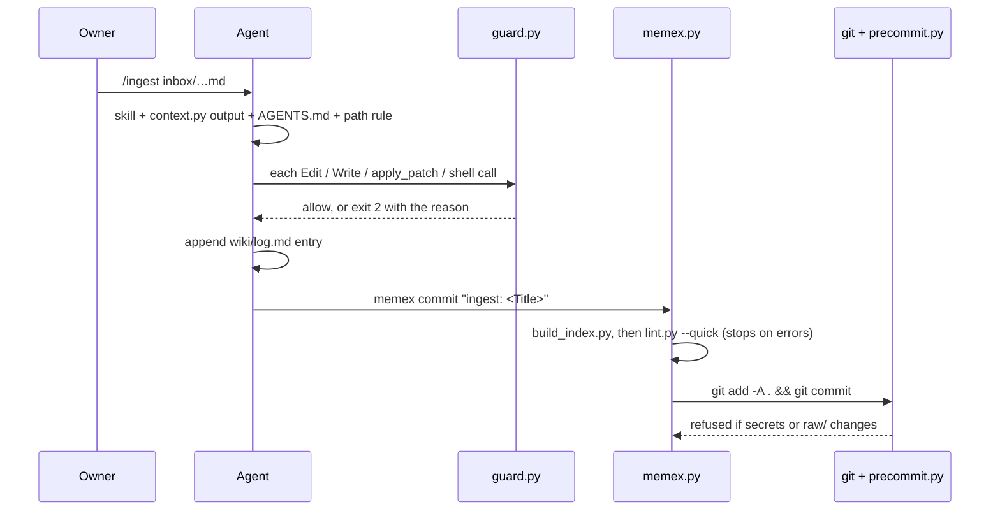

# Architecture

This guide is for anyone changing the **framework**: its tools, hooks, skills and schema. It's written for people and for coding agents. Agents *maintaining the wiki* follow `AGENTS.md` (= `CLAUDE.md`) instead; why each rule exists is in [[Design Rationale]].

> [!note] Two jobs, two documents
> **Maintaining the vault** (ingest, answer, lint) → `AGENTS.md`. The framework files are off limits there without the owner's approval.
> **Changing the framework** → this page. Then run `python3 meta/tools/test_memex.py` before committing.

## Components

| Piece | File(s) | Role | Invoked by |
|---|---|---|---|
| Schema | `CLAUDE.md` (`AGENTS.md` is a symlink) | ownership table, page conventions, integrity rules, procedures | loaded at session start by Claude Code, Codex and Hermes |
| Path rules | `.claude/rules/*.md` | per-domain and per-folder rules | Claude Code loads them by path; other agents are told to read them |
| Skills | `.claude/skills/<name>/SKILL.md` (`.agents/skills` is a symlink) | the operations: ingest, inbox, ask, save, lint, today, close, weekly, prep | `/name` (Claude Code, Hermes), `$name` (Codex) |
| Subagents | `.claude/agents/*.md` | `source-reader`, `fact-checker` (read-only) | Claude Code only; the schema tells other agents to do the job inline |
| Live context | `meta/tools/context.py` | prints what a skill needs (inbox, recent log, today's note…) | a skill's `` !`…` `` line |
| Session context | `meta/tools/memex.py context`, via `.claude/hooks/session_start.sh` | hot.md, recent log, inbox, lint age | Claude Code and Codex SessionStart; Hermes `pre_llm_call` (`memex hook hermes`) |
| Guard | `.claude/hooks/guard.py` | blocks edits, patches and shell commands that break the ownership table | every agent's pre-tool hook |
| CLI | `meta/tools/memex.py` | `search read context capture rm commit hook`, the same for every agent and the shell | agents in any project, skills, hooks |
| Index | `meta/tools/build_index.py` | generates `wiki/index.md` and one `<Domain> Index.md` per domain from page summaries | `memex commit`, session start |
| Lint | `meta/tools/lint.py` | deterministic checks: links, frontmatter, citations, quotes, secrets, staleness | `memex commit` (`--quick`), `/lint` |
| Pre-commit | `meta/tools/precommit.py` | refuses secrets and changes to existing `raw/` files | `git commit` (installed by setup) |
| Setup | `meta/tools/setup.sh` → `meta/tools/integrate.py` | per-machine: git hook, identity, agent wiring, index | the owner, once per machine |
| Global skill | `meta/tools/memex.SKILL.md` | template for the `memex` skill installed for each agent | `integrate.py` |
| Tests | `meta/tools/test_memex.py` | guard, CLI, pre-commit and integration tests in a temporary vault | contributors, CI |
| Obsidian | `.obsidian/`, `meta/bases/`, `meta/clipper/`, `meta/templates/` | viewer settings, dashboards, Web Clipper template, page templates | Obsidian; agents read templates |

## One write operation, end to end



## Enforcement layers

Each layer catches what the one above can miss. Prose alone is advice.

1. **Schema and skills**: what agents should do.
2. **Permissions**: what runs without a prompt. These are Claude Code `settings.json` allow/ask/deny lists and Codex `.rules` files; Hermes only prompts for dangerous shell commands.
3. **Guard hook**: deterministic, checked before each tool call, the same for all three agents. Shell checks are best-effort heuristics.
4. **Pre-commit hook**: catches anything that got past the guard, such as a write from a tool the guard doesn't see.
5. **Lint**: catches content problems after the fact.
6. **Git history**: every operation is one commit, so `git revert` undoes it.

## Agent integration

| | Claude Code | Codex | Hermes |
|---|---|---|---|
| Schema | `CLAUDE.md` | `AGENTS.md` | `AGENTS.md` |
| Vault skills | `.claude/skills` | `.agents/skills` | `.agents/skills` (after `hermes skills trust`) |
| Vault hooks | `.claude/settings.json` | `.codex/hooks.json` (trusted project) | none per project; global `~/.hermes/config.yaml` |
| Guard payload | `tool_name` Edit/Write/MultiEdit/NotebookEdit/Bash | `apply_patch` (patch text in `tool_input.command`), `Bash` (string or argv) | `write_file`, `patch` (replace or V4A patch), `terminal` |
| Block signal | exit 2 + stderr | exit 2 + stderr | exit 2 + stderr |
| No-prompt access from other projects | allow rules in `~/.claude/settings.json` | `~/.codex/rules/memex.rules` + writable root in `~/.codex/config.toml` | file tools aren't gated; hooks are approved once |

Codex keeps `.git` read-only inside its sandbox, so commits go through `memex commit`, which runs outside the sandbox under an `allow` rule.

## Invariants: keep these true

- **Standard library only** Python, 3.9 or newer, on macOS and Linux. No installs are needed to run the vault.
- **Tools never write outside the vault** (except `integrate.py`, which writes agent config), and **nothing ever pushes**.
- **Generated files are deterministic** (the indexes), so merges and diffs stay clean.
- **The guard fails open outside the vault and closed inside it**: an internal error blocks only calls that touch the vault. A new rule must never slow down or block unrelated work in other repos.
- **`CLAUDE.md` stays under ~200 lines.** Put detail in path rules and skills.
- **One skill set.** Edit `.claude/skills/`; `.agents/skills` is a symlink to it. A skill must make sense to all three agents: no Claude-only tool names in its steps, and `$ARGUMENTS` plus `` !`…` `` lines are explained in the schema.
- **Every skill ends in `memex commit`**, never raw `git commit`. That keeps indexing, lint and commit permissions uniform across agents.
- **`integrate.py` merges; it never overwrites.** It records what it added in `~/.config/memex/integration.json`, so re-runs don't duplicate and `--remove` is exact.

## Common changes

- **Add a guard rule**: edit `guard.py` (`check_write`, `check_edit`, `check_delete`, `check_move` or `check_shell`). Add allow *and* deny cases for each agent's payload format to `test_memex.py`.
- **Add a skill**: create `.claude/skills/<name>/SKILL.md` with `name` and `description` frontmatter. If it needs live data, add a branch to `context.py`. Finish with a log entry and `memex commit`. List it in the schema's *Operations* and the Manual's command table.
- **Add or rename a domain**: several places must change together:
  - `DOMAINS` and `GENERATED` in `memexlib.py`;
  - `TITLES`, the section order and the blurbs in `build_index.py`;
  - the schema's *Domains* section, plus a path rule in `.claude/rules/<domain>.md`;
  - the folders in `raw/` and `wiki/`;
  - the capture domains, which come from `DOMAINS` automatically;
  - the Dashboard views, if they filter by domain.
- **Support another agent**:
  1. teach `guard.py`'s `operations()` its tool payloads and add tests;
  2. add a function to `integrate.py` that installs the skill, its instructions and hooks, and records them in the state file;
  3. document it in the README and Manual tables.
- **Change page types**: update `TYPE_FOLDERS` in `memexlib.py`, add a template in `meta/templates/wiki/`, and update the schema's type ↔ folder list.

## Testing

```bash
python3 meta/tools/test_memex.py   # temporary vault + fake HOME; never touches this vault or your config
python3 meta/tools/lint.py          # the vault itself stays clean
bash -n meta/tools/setup.sh
```
CI (`.github/workflows/ci.yml`) runs the same checks on macOS and Linux.
